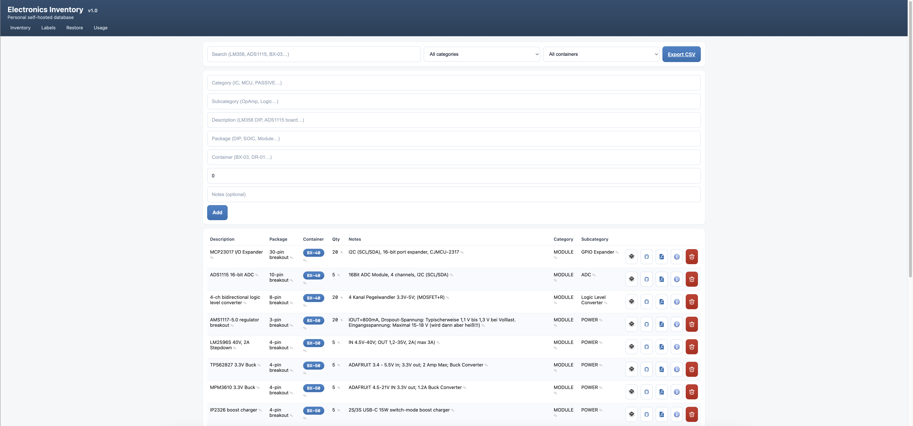

# Electronics Inventory

Version: **v1.0**

A lightweight web app to track electronics parts (category, subcategory, description, package, container, quantity, notes) with a simple HTML UI — including optional links to datasheets and pinouts.

> [!NOTE]
> If you’re looking for a more professional-grade (and free) inventory system with broader features, you may want to check out [InvenTree](https://inventree.org/) (it might be a better fit depending on your needs).

## Features

- Add, inline-edit, and delete parts
- Search + filter by category and container
- CSV export
- Optional links per part: datasheet + pinout (quick-open buttons in the table)
- Optional images per part: device photo + pinout image (hover preview in the table)
- Container pages and printable container labels with QR codes
- Uses a local SQLite database file (no server required)

## Screenshots



More screenshots:

- [Main screen (container pulldown)](docs/screenshots/Main_screen_pulldown_container.png)
- [Label selection](docs/screenshots/Print_label_selection.png)
- [Printable labels](docs/screenshots/Print_labels.png)
- [Restore parts (trash)](docs/screenshots/Restore_parts.png)

## Tech stack

- FastAPI (serves HTML)
- Jinja2 templates
- SQLite (stored in `inventory.db`)

## Quickstart (local)

### 1) Create a virtualenv

```bash
python3 -m venv .venv
source .venv/bin/activate
```

### 2) Install dependencies

```bash
pip install -r requirements.txt
```

QR code support is included via the `qrcode` dependency in `requirements.txt`.

### 3) Run the server

This app uses a login page + server-side sessions. You must configure credentials via environment variables.

Local-only (no authentication):

```bash
INVENTORY_DISABLE_AUTH=1 \
INVENTORY_BASE_URL="http://127.0.0.1:8001" \
uvicorn app:app --reload --host 127.0.0.1 --port 8001
```

Do not use `INVENTORY_DISABLE_AUTH` on an internet-exposed instance.

If you run behind a reverse proxy (recommended for HTTPS), also set `INVENTORY_BASE_URL` so label QR codes point to the correct external hostname.

Dev (auto-reload on code changes):

```bash
INVENTORY_USER="andreas" \
INVENTORY_PASS_HASH='$pbkdf2-sha256$...$...$...' \
INVENTORY_BASE_URL="http://127.0.0.1:8001" \
uvicorn app:app --reload --host 0.0.0.0 --port 8001 --proxy-headers
```

Prod (no reload):

```bash
INVENTORY_USER="andreas" \
INVENTORY_PASS_HASH='$pbkdf2-sha256$...$...$...' \
INVENTORY_BASE_URL="http://127.0.0.1:8001" \
uvicorn app:app --host 0.0.0.0 --port 8001 --proxy-headers
```

Open:

- <http://localhost:8001>

## Data storage

On startup, the app creates/uses a SQLite database at `inventory.db` (in the repo directory).

- To reset all data: stop the server and delete `inventory.db`.

## Useful routes

- `/` – main inventory table
- `/help` – help page
- `/export.csv` – download CSV export (respects current filters via query params)
- `/containers/{code}` – show parts in a specific container
- `/containers/labels` – printable labels with QR codes

## Images (device + pinout)

Each part can store optional image URLs:

- `image_url` – photo of the IC/module/device

Pinouts are stored in `pinout_url`. If `pinout_url` points directly to an image, the table shows a hover preview.

### Recommended: store images in `static/`

Store images under the repo's `static/` folder (for example `static/images/` and `static/pinouts/`).
Then reference them with a URL starting with `/static/...`:

- `image_url`: `/static/images/MP2307_HW133ABC_board.jpg`
- `pinout_url`: `/static/pinouts/MP2307_pinout.jpg`

### Hover preview behavior

If the URL ends with an image extension (`.png`, `.jpg`, `.jpeg`, `.gif`, `.webp`, `.svg`), the table shows a hover preview.
Clicking the preview opens the image in a new tab.

On touch devices (mobile/tablet), previews are shown by tapping the icon (instead of hovering). Use the × button to close the preview.

## QR label URLs (important)

Container label QR codes are generated using `BASE_URL` in `app.py`.

- Configure the external base URL via `INVENTORY_BASE_URL` so QR codes point to a reachable URL (LAN IP or public HTTPS hostname).

Example (behind reverse proxy + HTTPS):

```bash
export INVENTORY_BASE_URL="https://inventory.reverseproxy.com"
```

## Label printing layouts

Label printing is implemented as:

- Shared label UI/print styles: `static/labels.css`
- One layout file per Avery preset: `static/avery_<preset>.css` (e.g. `static/avery_3425.css`)

**Trademark notice:** Avery® is a registered trademark of its respective owner (commonly Avery Products Corporation and/or affiliated entities). This project is not affiliated with, sponsored, or endorsed by Avery. The Avery name and label numbers are used only to indicate intended compatibility with commonly available label sheets.

To add a new layout later:

1) Create `static/avery_<new-id>.css`
2) Reload the Labels page — the preset list is discovered automatically from `static/avery_*.css`

### Print calibration (offset + spacing)

Printers often introduce small feed/margin offsets even with “Margins: none”. Each preset CSS supports knobs:

- `--label_offset_x` / `--label_offset_y` (shift the whole sheet; negative moves left/up)
- `--label_gap_x` / `--label_gap_y` (space between labels)

Example (move 5mm left and 1mm up):

```css
--label_offset_x: -5mm;
--label_offset_y: -1mm;
```

### Outlines (calibration vs Avery sheets)

By default, label borders are **not printed** (best for real Avery sheets where tiny alignment offsets can make printed
outlines look off).

For calibration or printing on plain paper (where you want cut guides), enable **Print cut outlines** on the Labels page
before printing *(always shown on screen; printed only when enabled)*.

## Authentication

This app uses a **login page + server-side sessions** (stored in SQLite) for all routes.

Configure it with:

- `INVENTORY_USER` – username
- `INVENTORY_PASS_HASH` – password hash in Passlib `pbkdf2_sha256` format
- `INVENTORY_BASE_URL` – optional; external base URL used for container label QR codes

Optional (local-only):

- `INVENTORY_DISABLE_AUTH` – when set to `1`/`true`, disables authentication entirely.
  Use only for fully local deployments (e.g. bound to `127.0.0.1`). Do not enable this on an internet-exposed instance.

Note: the session cookie is configured as `secure`, so you should access the app via HTTPS (directly or via reverse proxy).

Generate a hash (example):

```bash
python3 -c "from passlib.hash import pbkdf2_sha256; print(pbkdf2_sha256.hash('change-me'))"
```

Run with credentials (example):

```bash
export INVENTORY_USER="andreas"
export INVENTORY_PASS_HASH='<paste-hash-here>'
uvicorn app:app --host 0.0.0.0 --port 8001 --proxy-headers
```

If `INVENTORY_USER` / `INVENTORY_PASS_HASH` are not set, the login page will show an error because auth is not configured.

Note: the Passlib hash contains `$` characters. Use **single quotes** around `INVENTORY_PASS_HASH` (or escape `$`) to avoid shell expansion.

## Notes

- Security: even with Basic Auth, treat this as a trusted-LAN tool. Do not expose it directly to the public internet.
- If you need remote access, prefer a VPN and restrict access.

## License

MIT — see [LICENSE](LICENSE).
